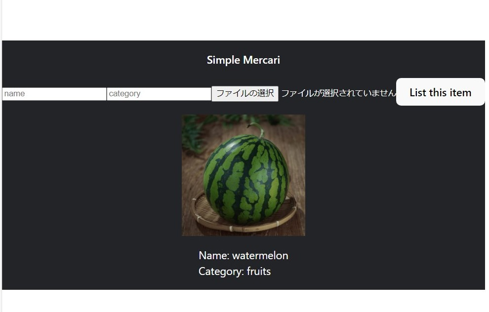

# Build@Mercari Training Program 

This is Xin TONG's build training repository.
Forked from [Build@Mercari Training Program](https://github.com/mercari-build/mercari-build-training)

It realized a small web-service called *mini-mercari* as the picture shows,   where you can add items into the database and their info will be listed below. (*A part of front-end codes is provided by mercari)

## Tasks

- [ ] **STEP1** Git ([JA](document/01-git.ja.md)/[EN](document/01-git.en.md))
- [ ] **STEP2** Setup environment ([JA](document/02-local-env.ja.md)
  /[EN](document/02-local-env.en.md))
- [ ] **STEP3** Algorithms and Data Structures([JA](document/03-algorithm-and-data-structure.ja.md)/[EN](document/03-algorithm-and-data-structure.en.md))
- [ ] **STEP4** Develop API ([JA](document/04-api.ja.md)
  /[EN](document/04-api.en.md))
- [ ] **STEP5** Database ([JA](document/05-database.ja.md)/[EN](document/05-database.en.md))
- [ ] **STEP6** Writing Tests ([JA](document/06-testing.ja.md)/[EN](document/06-testing.en.md))
- [ ] **STEP7** Docker ([JA](document/07-docker.ja.md)/[EN](document/07-docker.en.md))
- [ ] **STEP8** Continuous Integration(CI) ([JA](document/08-ci.ja.md)
  /[EN](document/08-ci.en.md))
- [ ] **STEP9** (Stretch) Frontend ([JA](document/09-frontend.ja.md)
  /[EN](document/09-frontend.en.md))
- [ ] **STEP10** (Stretch)  Run multi service ([JA](document/10-docker-compose.ja.md)
  /[EN](document/10-docker-compose.en.md))

